# InterviewAce 🚀

A Full Stack Interview Preparation Platform built using React, Spring Boot, JWT Authentication, and MySQL.

InterviewAce helps students and job seekers prepare for interviews through MCQ assessments, performance tracking, leaderboards, resume management, and profile building features.

---

## Features

### Authentication

* Secure Login System
* JWT Based Authentication
* Protected Routes

### Dashboard

* User Dashboard Overview
* Performance Summary

### MCQ Assessment System

* MCQ Test Module
* Test Attempt Tracking
* Score Calculation

### Performance Analytics

* Result Analysis Dashboard
* Leaderboard Ranking System

### Profile Management

* Profile Information Management
* Education Management
* Experience Management
* Skills Management
* Project Management
* Resume Management

### Administration

* Admin Dashboard

---

## Tech Stack

### Frontend

* React.js
* React Router
* Axios
* CSS3

### Backend

* Java 17
* Spring Boot
* Spring Security
* JWT Authentication
* Spring Data JPA

### Database

* MySQL

### Build Tools

* Maven
* npm

---

## System Architecture

```text
Frontend (React.js)
        │
        ▼
REST APIs (Axios)
        │
        ▼
Spring Boot Backend
        │
        ▼
MySQL Database
```

---

## Project Structure

```text
InterviewAce
│
├── backend
│   ├── src
│   ├── pom.xml
│   └── ...
│
├── frontend
│   ├── src
│   ├── public
│   └── ...
│
├── screenshots
│
├── API_DOCUMENTATION.md
├── PROJECT_SETUP_GUIDE.md
├── PROJECT_SUMMARY.txt
└── README.md
```

---

## Screenshots

## Screenshots

### Login Page

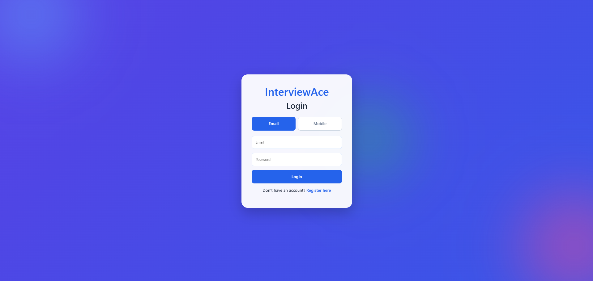

### Dashboard

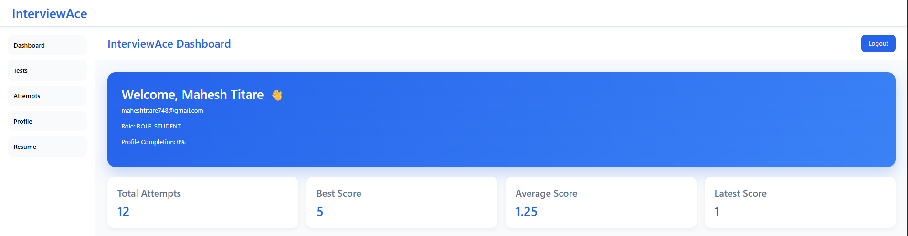

### MCQ Test

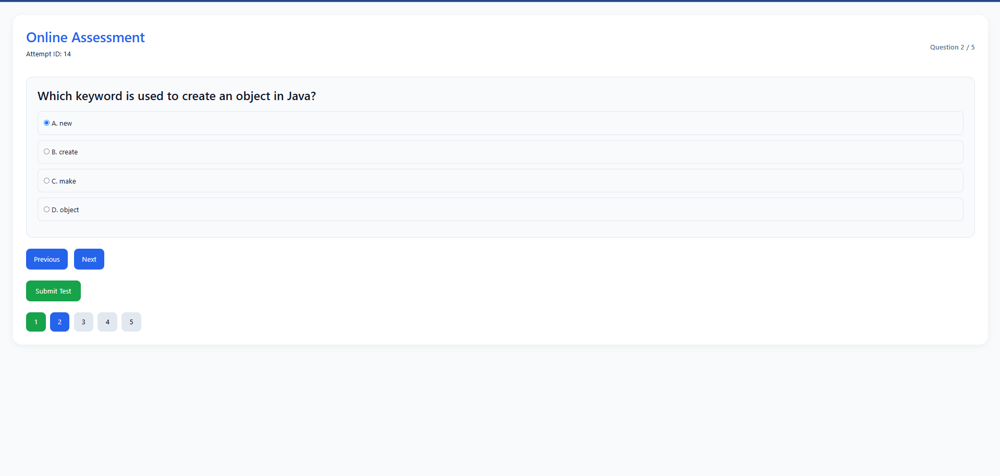

### Result Analysis

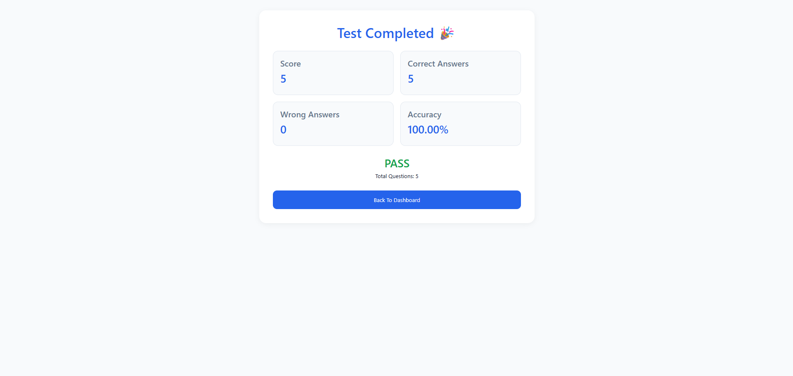

### Leaderboard

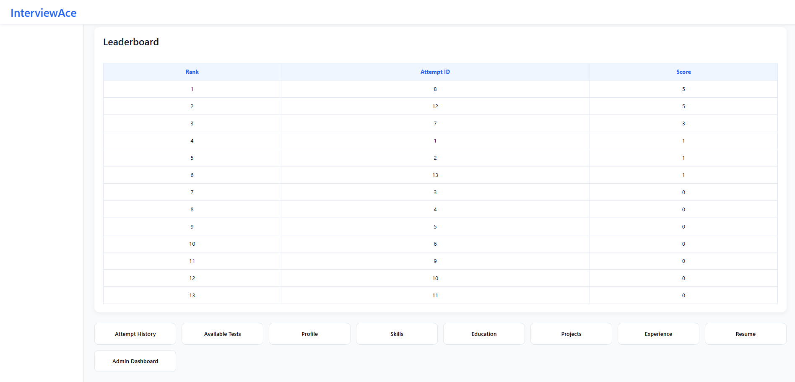

### Profile

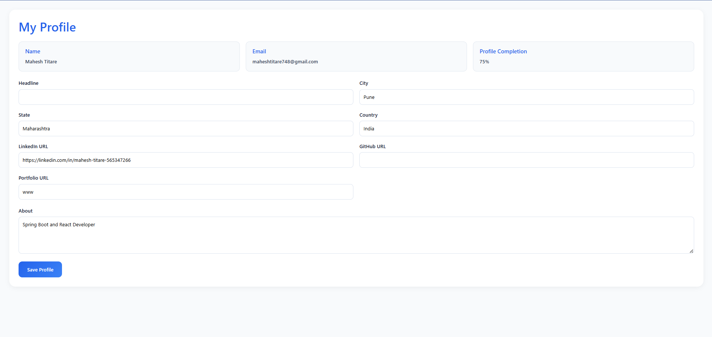

### Education

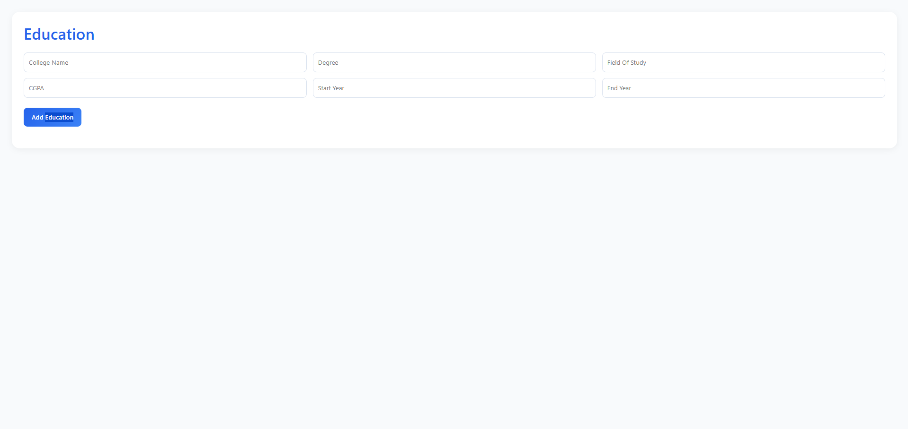

### Experience

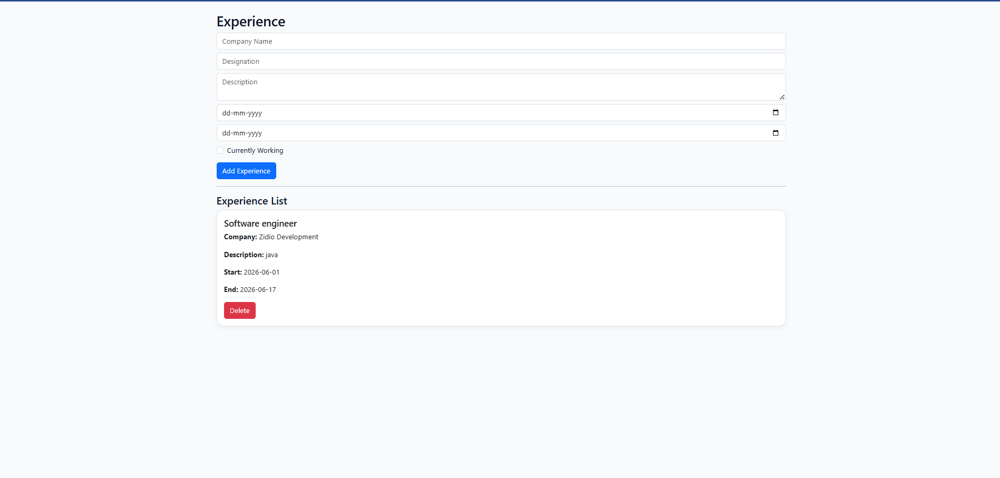

### Skills

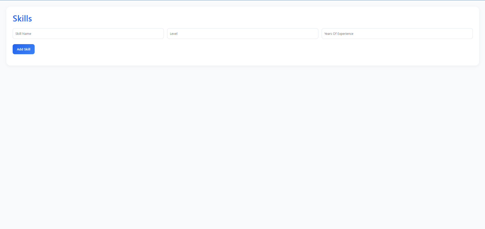

### Projects

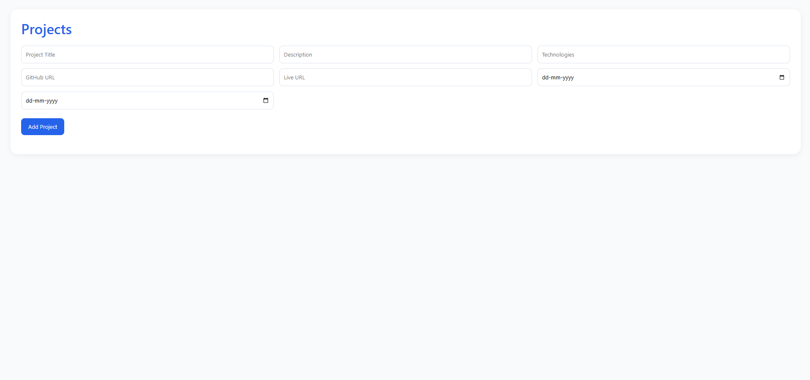

### Resume

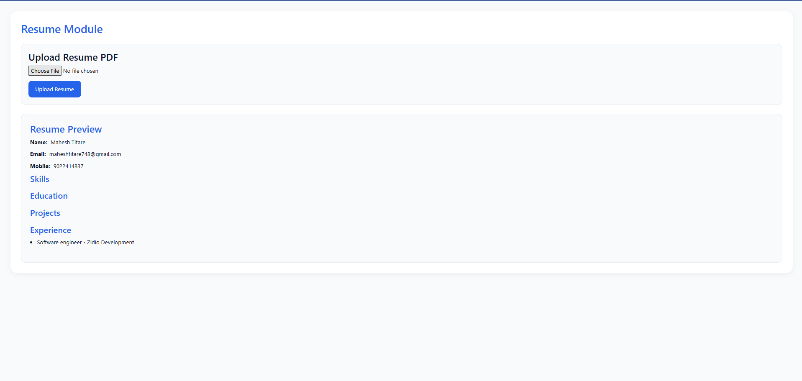

### Attempts

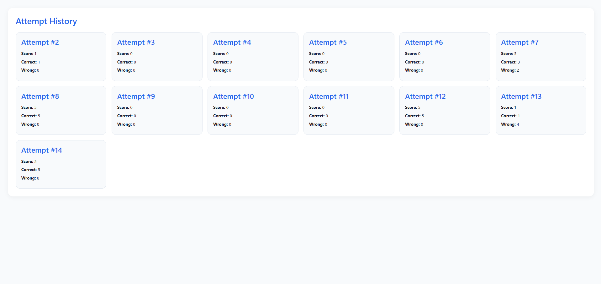

### Admin Dashboard

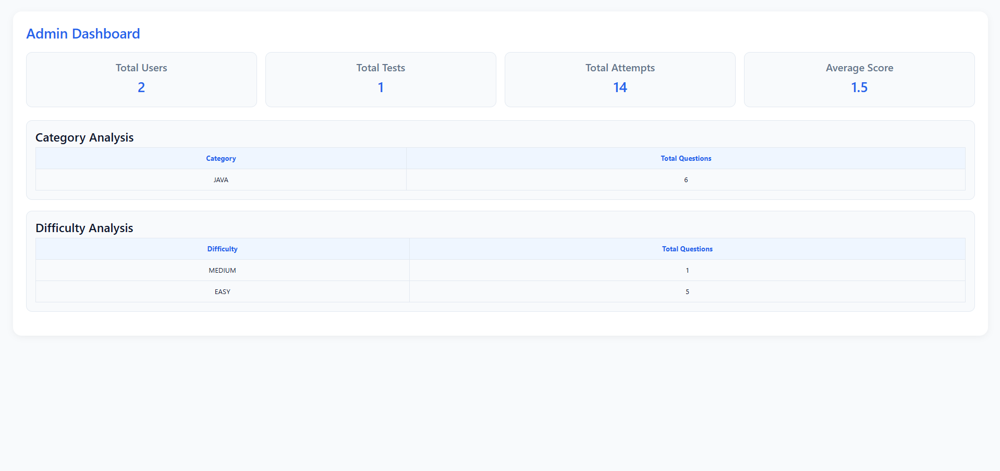


---

## Getting Started

### Clone Repository

```bash
git clone https://github.com/maheshtitare/InterviewAce.git
cd InterviewAce
```

### Backend Setup

```bash
cd backend
mvn clean install
mvn spring-boot:run
```

Backend runs on:

```text
http://localhost:8080
```

### Frontend Setup

```bash
cd frontend
npm install
npm start
```

Frontend runs on:

```text
http://localhost:3000
```

---

## Documentation

### API Documentation


## Key Modules

* Authentication Module
* Dashboard Module
* MCQ Test Engine
* Result Analysis Module
* Leaderboard Module
* Profile Management Module
* Resume Management Module
* Admin Dashboard Module

---

## Future Enhancements

* Coding Assessment Module
* Advanced Analytics Dashboard
* Interview Feedback System

---

## Author

Mahesh Titare

Java Full Stack Developer

Email: [maheshtitare748@gmail.com](mailto:maheshtitare748@gmail.com)

GitHub: https://github.com/maheshtitare


---

